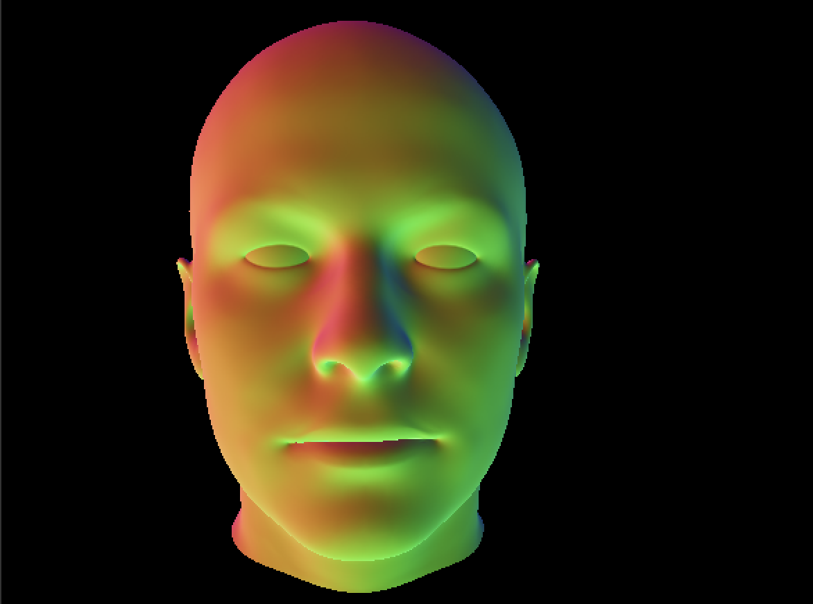
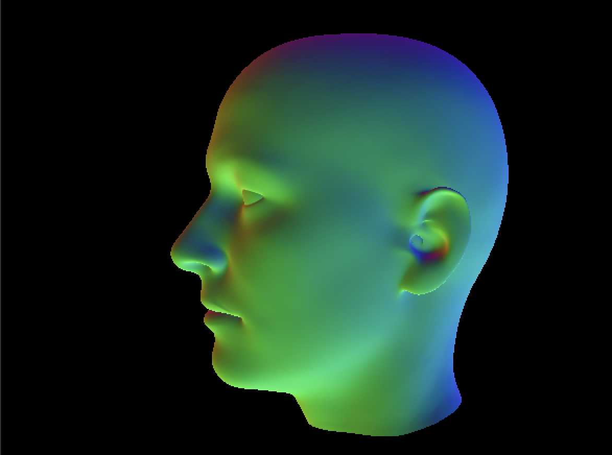

# Morphable-Model-Face-Renderer

Morphable Model Face Renderer is a project aimed at rendering 3D face models utilizing the Basel Face Models. The project encompasses the processing of Basel Face Models, conversion to `.obj` format, making the data OpenGL-readable, and establishing a rendering pipeline for rendering any `.obj` files generated.

Current rendering of Avg Face Model:

## Features

- Processing Basel Face Models stored in HDF5 format.
- Conversion of Face Models to `.obj` format.
- Preparation of data for OpenGL rendering including winding order correction and normal calculation.
- OpenGL rendering pipeline ready for rendering any `.obj` file.
- (Planned) Advanced shader enhancements for more realistic rendering.
- (Planned) Model fitting functionality to generate a 3D face model from a 2D image.

## Processing and Conversion

The Basel Face Models were initially processed and stored in HDF5 format. They were then converted into `.obj` format to make them compatible with OpenGL rendering.

### Data Preparation for OpenGL

The data underwent further preparation to be made OpenGL-readable. This included winding order correction and normal calculation which are crucial for accurate rendering.

## Rendering Pipeline

An OpenGL rendering pipeline has been established capable of rendering any `.obj` files generated from the Basel Face Models. 

### Future Enhancements

- Implementing advanced shaders to enhance the realism of the rendered models.
- Developing a model fitting functionality to generate a 3D face model from a 2D image.

## Acknowledgments

- Basel Face Model for providing the face models used in this project.
